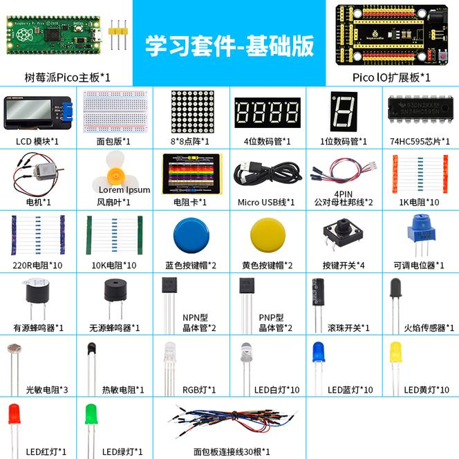
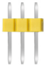
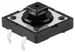
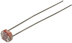
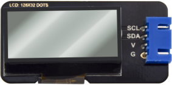
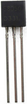

首先感谢选择keyes产品, 我们将继续为你提供好的产品和服务!

关于keyes

Keyes是KEYES Corporation旗下最畅销的品牌，我们的产品包括Arduino开发板，扩展板，传感器模块，树莓派，micro：bit扩展板和智能小车，以及为各种级别的客户设计的完整入门套件，这些入门套件旨在为任何水平的客户学习Arduino知识。

我们所有的产品均符合国际质量标准，并在世界各地的不同市场中得到了极大的赞赏。

欢迎从我们的官方网站查看更多内容：

[www.keyes-robot.com](http://www.keyestudio.com)

获取资料和售后服务

1.  Keyes树莓派Pico     学习套件基础版的资料下载地址：

<https://pan.baidu.com/s/1Srx-S0iIk6JH0P1x817DFA>  提取码：keye

2.如果发现某些东西丢失或损坏，或者学习套件时遇到一些困难。keyes会提供免费和快速的支持，如果您有任何疑问，请联系我们专业的销售人员。

3.欢迎提出建议和反馈，我们会根据您的反馈不断更新套件和教程，以使其更好。谢谢！

产品安全

1.本产品内的一些电子元件和传感器模块有细小的针脚，请勿让7岁以下的儿童接触，防止误伤，应放在他们拿不到的地方。

2.本产品包含导电部件(控制板和电子模块），请按照本教程的要求进行操作，不当的操作可能导致过热并且损害零件，请勿触摸并立即断开电路电源。

版权

keyes商标和徽标是KEYES DIY ROBOT co.,LTD的版权,任何人和公司在没有授权的情况下，不得复制，售卖，转卖keyes品牌的产品。如果你有兴趣在当地售卖我们的产品，请联系我们专业的批发销售人员。

Keyes 树莓派Pico 学习套件基础版

# 简介

你想学习编程知识吗?

只要你对科学充满热情，敢于探索新事物，这个Keyes树莓派Pico
学习套件基础版主要包含了我们常用的一些电子元件/传感器/模块，同时还包含树莓派Pico板、树莓派Pico板的扩展板和面包线等。该工具包附带22个项目教程，每个教程都有详细的接线图、元件知识和迷人的项目代码等，完全适合初学者。每一个项目教程都是用Windows操作系统的MicroPython IDE软件平台Thonny制作，树莓派的MicroPython IDE软件平台Thonny制作和Windows操作系统Arduino IDE软件平台制作，入门非常简单。用一个控制器（树莓派Pico板），许多传感器/模块和电子元件，你可以做许多精彩的DIY项目。通过这些课程，可以让我们对编程方法、逻辑、电子电路以及linux操作系统（Raspberry Pi）有了更深刻的理解。

# 清单

当收到这个Keyes树莓派Pico
学习套件基础版的时候，首先看到是一个包装精美的外盒，每个配件被安全且有序的装在外盒里面的小袋子里，先来清点一下：

|序号|名称|数量|图片|
|-|-|-|-|
|1|树莓派Pico板|1| |
|2|树莓派Pico板的扩展板|1||
|3|蓝色LED|10||
|4|红色LED|10||
|5|黄色LED|10||
|6|绿色LED|10||
|7|白色LED|10||
|8|RGB|1||
|9|220Ω电阻|10||
|10|10KΩ电阻|10||
|11|1KΩ电阻|10||
|12|10KΩ电位器|1||
|13|有源蜂鸣器|1||
|14|无源蜂鸣器|1||
|15|按键开关|4||
|16|倾斜开关|1||
|17|光敏电阻|3||
|18|火焰传感器|1||
|19|10K热敏电阻|1||
|20|黄帽|2||
|21|蓝帽|2||
|22|IC 74HC595N|1||
|23|一位数码管|1||
|24|四位数码管|1||
|25|8*8点阵屏|1||
|26|LCD_128X32_DOT|1||
|27|NPN型晶体管(S8050)|2||
|28|PNP型晶体管(S8550)|2||
|29|三叶软桨|1||
|30|130直流电机|1||
|31|面包板连接线|30||
|32|公对母杜邦线|40||
|33|面包板|1||
|34|USB线|1||
|35|电阻卡|1||
|36|二极管|1||
|37|4P 转杜邦公单头|2||

