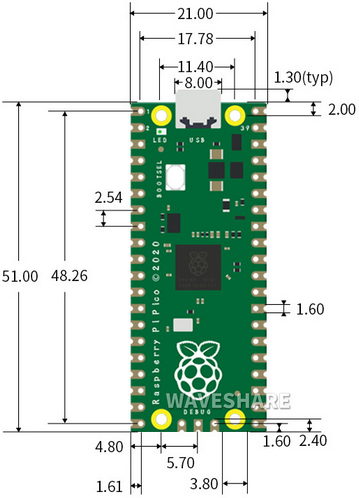

# 树莓派 Pico主板

1. Pico简介：

树莓派Pico主板是一款树莓派官方设计的低成本，高性能的微控制器开发板，具有灵活数字接口。硬件上，采用树莓派官方自主研发的
RP2040 微控制器芯片，搭载了ARM Cortex M0 + 双核处理器，高达 133MHz
的运行频率，内置了 264KB 的 SRAM 和 2MB 的内存，还板载有多达 26
个多功能的 GPIO 引脚。软件上，可选择树莓派提供的 C/C++ SDK，或者使用
MicroPython
进行开发，且配套有完善的开发资料教程，可方便快速入门开发，并嵌入应用到产品中。

2. Pico特性：

※ 采用了树莓派官方自主设计的 RP2040 微控制器芯片

※ 搭载了双核 ARM Cortex M0 + 处理器，运行频率高达 133MHz 灵活时钟

※ 芯片内置 264KB 的 SRAM 和 2MB 的片上 Flash

※ 邮票孔设计，可直接焊接集成到用户自主设计的底板上

※ USB1.1 主机和设备支持

※ 支持低功耗睡眠和休眠模式

※ 可通过 USB 识别为大容量存储器进行拖放式下载程序

※ 多达 26 个多功能的 GPIO 引脚

※ 2 个 SPI，2 个 I2C，2 个 UART，3 个 12 位 ADC，16 个可控 PWM 通道

※ 精确的片上时钟和定时器

※ 温度传感器

※ 片上加速浮点库

※ 8个可编程 I/O (PIO) 状态机，用于自定义外设支持

3.  Pico主板规格参数：

微控制器：RP2040 微控制器芯片

CPU：Dual-core Arm Cortex-M0+ @ 133MHz

USB转串口芯片：内置USB1.1 PHY主机和设备支持，通过 USB
识别为大容量存储器进行拖放式下载程序

工作电压：3.0V-3.6V

工作电流：平均80mA

供电电流：500mA

外接电源：DC电源为6-12V（建议9V），USB电源为5V

Flash Memory：内置2MB

SRAM：内置264KB

集成晶振：12MHz

尺寸图：

4.  Pico主板原理图：

5.  Pico主板引脚分布：

|GND|Ground 引脚|
|-|-|
|Power|VBUS(microUSB 电压)、VSYS(2-5VDC 输入电压)、3V3(3.3V 输出电压) 3V3_EN(Enables Pico)|
|System Control|运行(启动或禁用RP2040微控制器或复位)|
|ADC|树莓派Pico主板共有5个ADC，分辨率为12位，分别是ADC0(GP26)、ADC1(GP27)、ADC2(GP28)、ADC3(GP29)、ADC4。其中，ADC3(GP29)用于测量Pico板上的VSYS；ADC4直接连接到RP2040内置的温度传感器。ADC_VREF可以连接到外部精确的电压表作为ADC参考。ADC_GND引脚作为接地参考点。|
|PWM|树莓派Pico主板上有16个PWM通道，每个通道可以独立控制频率和占空比。GPIO引脚切换到PWM功能。|
|UART|有2个UART： UART0,UART1。|
|I2C|有2个 I2C： I2C0 I2C1。|
|SPI|有2个SPI：SPI0,SPI1。|
|Debugging|它在调试代码时被使用|

相关详细信息：[<u>https://datasheets.raspberrypi.com/pico/pico-datasheet.pdf</u>](https://datasheets.raspberrypi.com/pico/pico-datasheet.pdf)

