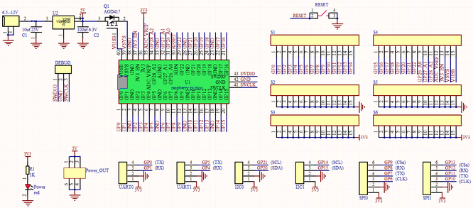
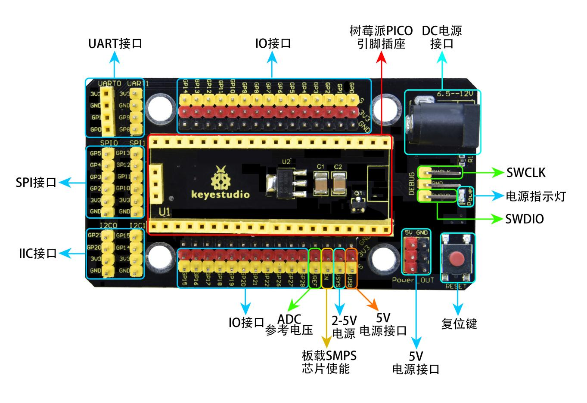
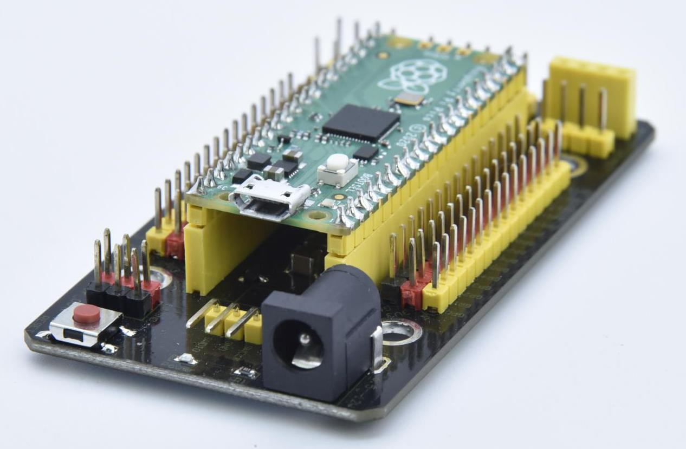

# Keyestudio 树莓派 pico IO 扩展板

1.概述

Keyestudio 树莓派 pico IO 扩展板是专为树莓派
Pico开发板的扩展板，无需焊接，全引脚引出。为方便接线，扩展板上接口都带有丝印。3pin接口丝印一般为G V
S，其中扩展板上所有的G代表GND，V代表VCC（3.3V）接口，S代表接口上方的数字口/模拟口。4pin/6pin接口左面都有对应接口丝印。扩展板上自带间距为2.54mm的排母接口，接线顺序和Pico板的排母接口的线序一致。同时扩展板上自带一个复位按键，1个电源指示灯PWR。同时扩展板自带4个标准乐高定位孔。

该扩展板提供各种通信接口包括2 x I2C、2 x UART、2 x SPI、3 x 模拟IO和13 x
数字IO，并提供6.5-12V的电源接口为原型开发提供最简单的连接方式。

2.规格参数

输出电流：≦500mA

DC输入电压：6.5 - 12V

输出电压：DC3.3V\5V

推荐环境温度：-10°C ~ 50°C

产品尺寸：45.339MM \*83.617MM

排针间距：2.54mm

3.原理图

4.接口说明

5.使用方法

将树莓派 Pico板堆叠在扩展板上即可使用，如下图：

