# Python 教程 Windows

## 开发环境设置（重要）

在开始构建项目之前，你需要首先做一些准备，这是非常重要的，你不能跳过。

1.  安装Thonny(重要)

Thonny是一个免费、开源的软件平台，体积小，界面简单，操作简单，功能丰富，是一个适合初学者的Python IDE。在本教程中，我们使用这个IDE在整个过程中开发树莓派Pico。Thonny支持多种操作系统，包括Windows, Mac OS, Linux。

1.  下载Thonny软件

(1)进入软件官网：[https://thonny.org](https://thonny.org)下载Thonny软件，最好下载最新版的，否则可能不支持树莓派
Pico.

(2)Thonny的开源代码库：[https://github.com/thonny/thonny](https://github.com/thonny/thonny)

请按照官网的指导安装或点击下面的链接下载安装。(请根据您的操作系统选择相应的选项.)

|操作系统|下载链接/方法|
|-|-|
|MAC OS：|[https://github.com/thonny/thonny/releases/download/v3.2.7/thonny-3.2.7.pkg"](https://github.com/thonny/thonny/releases/download/v3.2.7/thonny-3.2.7.pkg)|
|Windows：|[https://github.com/thonny/thonny/releases/download/v3.2.7/thonny-3.2.7.exe"](https://github.com/thonny/thonny/releases/download/v3.2.7/thonny-3.2.7.exe)|
|Linux：|最新版本: Binary bundle for PC (Thonny+Python): bash <(wget -O - https://thonny.org/installer-for-linux) With pip: pip3 install thonny Distro packages (may not be the latest version): Debian, Rasbian, Ubuntu, Mint and others: sudo apt install thonny Fedora: sudo dnf install thonny|

2.  在Windows上安装Thonny软件

1.  下载后的Thonny图标如下。

2.  双击“thonny-3.3.13.exe”，会出现下面对话框，我这里是选择“”进行操作的。你也可以选择“”进行操作的。

3.  如果您不熟悉电脑软件安装，您可以一直单击“Next”直到安装完成。

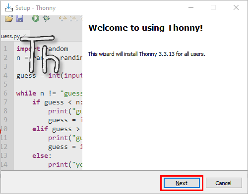

4.  如果您需要更改Thonny软件的安装路径，可以单击“Browse...”进行修改。选择安装路径后，单击“OK”。

如果您不想更改安装路径，只需单击“Next”；然后又继续单击“Next”。

5.  选中“Create desktop     icon”，Thonny软件会在你的桌面上生成一个快捷方式，方便你稍后打开Thonny软件。

6.  单击“Install”安装软件。

7.  在安装过程中，您只需等待安装完成，千万不要点击“Cancel”，否则将无法安装成功。

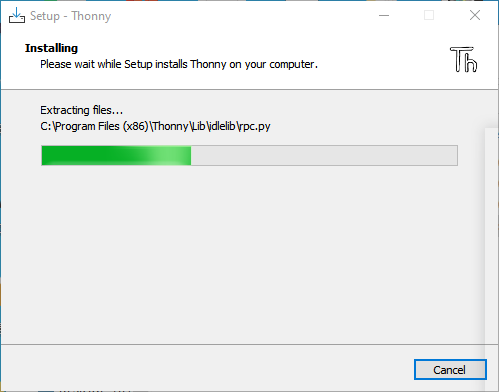

8.  一旦看到如下界面，就表示已经成功安装了Thonny软件，点击“Finish”就可以。

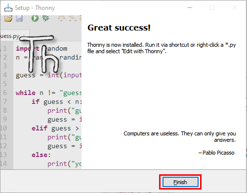

9.  如果你在安装过程中选择了“Create desktop     icon”，则可以在桌面上看到如下图标。

2.  Thonny软件基本配置

1.  双击Thonny软件的桌面图标，可以看到如下界面，同时还可以进行语言选择(这里选择简体中文)和初始设置。设置完了点击“Let’s     go！”。

2.  选择“视图”→“文件”和“Shell”。

3.  更新Micropython固件（重要）

要在树莓派Pico板上运行MicroPython程序，我们需要先烧入一个固件到树莓派Pico板中。

1.  为什么我们需要更新固件

树莓派Pico板可以用C语言和MicroPython语言编程，并且树莓派Pico板出厂时没有MicroPython固件，使用MicroPython编程之前需要下载MicroPython固件。

注意：MicroPython固件只需要下载一次，当使用MicroPython编程时不需要再次下载。如果你已经下载了用C语言编写的 .uf2
程序固件，则MicroPython固件将会被覆盖，那下次你使用MicroPython时，你需要按照以下步骤更新树莓派Pico板的固件。

2.  下载Micropython固件

方法1：树莓派Pico的官网：[https://www.raspberrypi.com/documentation/microcontrollers/](https://www.raspberrypi.com/documentation/microcontrollers/)

1.  单击上面的链接，你可以看到以下界面：

2.  滚动鼠标，你又可以看到以下内容：

3.  单击“MicroPython(Getting started     MicroPython)”进入固件下载页面。

方法2：通过单击下载链接：[https://micropython.org/download/rp2-pico/rp2-pico-latest.uf2](https://micropython.org/download/rp2-pico/rp2-pico-latest.uf2)，可以直接下载。

方法3：如果你因为网络问题或其他原因无法下载，可以使用我们准备的 .uf2
文件，它位于以下文件路径

3.  烧入MicroPython固件的步骤

①连接microUSB线一端到你的电脑USB口。

②长按“树莓派Pico板”上的白色按钮（BOOTSEL）。然后，通过microUSB线另一端将树莓派Pico板与电脑连接。

③松开按钮，当连接成功时，在你的电脑上打开\[设备管理器\]，电脑将自动识别可移动磁盘(RPI-RP2)，如下所示:

④复制文件（rp2-pico-20210902-v1.17.uf2）到可移动磁盘(RPI-RP2)，并等待它完成，就像复制文件到U盘一样。

⑤当固件烧入完成后，树莓派Pico板会自动重启。之后，你可以运行Micropython。

四、Thonny软件连接上树莓派Pico板

1.打开Thonny软件，点击“运行”并选择“选择解释器…”

3.  选择“Micropython (一般)”或“Micropython (Raspberry Pi     Pico)”均可。如何选择“Micropython(Raspberry Pi Pico)”?
    如下所示：

3.选择“USB-SERIAL (COMx)”，“COMx”的编号在不同的电脑之间可能会有所不同。你只需要确保选择“USB-SERIAL (COMx)”就行。

如何确定你的树莓派Pico板与电脑通信的端口?

步骤1:当你的树莓派Pico板没有连接到电脑时，打开Thonny软件，点击“运行”，选择“选择解释器...”，弹出对话框，点击“端口”，可以查看当前连接的端口，如下图所示:

步骤2:关闭对话框。将树莓派Pico板连接到电脑，再次单击“运行”并选择“选择解释器...”。单击弹出窗口中的“端口”，查看当前端口。现在又增加了一个端口，那么这个端口是用来与电脑通信的。

4.  选择“Micropython(Raspberry Pi Pico)”和端口后，单击“确定”。

5.  当在Thonny软件上显示以下消息时，表明Thonny软件已成功连接到树莓派Pico板。

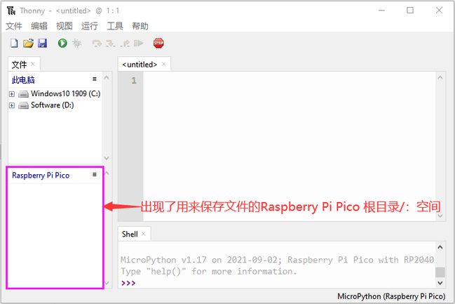

到目前为止，所有的准备工作都已就绪。

五、测试代码(重要)

1.测试Shell命令

在“Shell”窗口输入“print(Hello World!)”，按“Enter”键。

2.在线运行代码：

要在线运行树莓派Pico，你需要把树莓派Pico板连接到电脑上。这样就可以使用Thonny软件编译或调试程序。

优点：（1）你可以使用Thonny软件编译或调试程序。

（2）通过“Shell”窗口，你可以查看程序运行过程中产生的错误信息和输出结果，并可以在线查询相关功能信息，帮助改进程序。

缺点：（1）要在线运行树莓派Pico，你必须将树莓派Pico板连接到一台电脑上并和Thonny软件一起运行。

（2）如果树莓派Pico板与电脑断开连接，当它们重新连接时，程序将无法再次运行。

基本操作：

（1）打开Thonny软件，并且单击“打开...”。

（2）在新弹出的窗口中，点击“此电脑”。

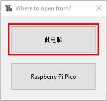

在新的对话框中，进入文件夹2. 项目教程\项目 01：Hello World
选中“Project_01_HelloWorld.py”,单击“Open”。本教程中使用的代码保存在“3. Python 教程\1. Windows 系统\2.
项目课程”中。你可以把代码移到任何地方。例如，我们将“2.
项目课程”文件夹保存在Disk(D)中，路径为D:\2. 项目课程。

（3）单击“运行当前脚本”来执行程序“Hello World!”, "Welcome keyes" 将打印在“Shell”窗口。

退出在线运行

当在线运行时，单击Thonny软件上的“停止
/重启后端进程”或按Ctrl+C退出程序。

3.离线运行代码：

在离线运行时，树莓派Pico板不需要连接电脑和Thonny软件。一旦上电，它就可以运行存储在树莓派Pico板中的main.py程序。

优点：不需要连接电脑和Thonny软件就可以运行程序。

缺点：出现错误或树莓派Pico板没电时，程序会自动停止，并且代码不容易更改。

基本操作：

一旦上电后，树莓派Pico板会自动检查设备上是否存在main.py。如果有，则运行main.py中的程序，然后进入shell命令系统。(如果你想让代码离线运行，你可以将它保存为main.py);
如果main.py不存在，则直接进入shell命令系统。

（1）单击 “文件”→“新文件” 创建并编写代码。

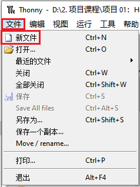

（2）在新打开的文件中输入代码。这里我们以Project_02_Onboard_LED_flashing.py代码为例。

（3）单击菜单栏上的“保存”,
你可以将代码保存到此电脑或Raspberry Pi Pico。

4.  选择“Raspberry Pi     Pico”，在新弹出的窗口中输入“main.py”并单击“确认”。

5.  你可以看到代码已经被上传到树莓派Pico板。

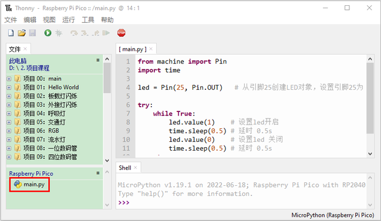

（6）断开树莓派Pico板的microUSB线，再重新连接，树莓派Pico板上的LED会反复闪烁。

0.5秒

退出离线运行

连接树莓派Pico板到电脑，点击Thonny软件上的“停止
/重启后端进程”结束离线运行。

如果它不能工作，请点击Thonny软件上的“停止
/重启后端进程”多次或重新连接树莓派Pico板。

我们提供了一个main.py文件用于离线运行。添加到main.py中的代码是执行用户代码文件的引导程序。你只需要将离线项目的代码文件(.py)上传到“Raspberry Pi Pico”。

①将程序文件夹“3. Python 教程\1. Windows 系统\2.
项目课程”提前移动到Disk(D)，路径为D:\2.
项目课程。打开Thonny软件。

②在Disk(D)目录下D:\\2.
项目课程中展开“项目
00：main”，鼠标左键双击main.py，我们提供的main.py可以使“Raspberry Pi Pico”中的代码离线运行。

这里，我们使用项目 00和项目
02案例作为演示。使用树莓派Pico板上的LED（GP25引脚）显示结果。如果你已经修改了Project_02_Onboard_LED_flashing.py文件，那么你需要相应地修改它。如下图所示，鼠标右键单击Project_02_Onboard_LED_flashing.py文件，选择“上载到
/“上传代码到 Raspberry Pi Pico。

用同样的方法上传main.py

断开树莓派Pico板的microUSB线并重新连接，树莓派Pico板上的LED将反复闪烁。

0.5秒

注意:

这里的代码是离线运行的。如果你想停止离线运行并且在“Shell”窗口显示对应信息，只需单击Thonny软件上的“停止
/重启后端进程”。

六、Thonny常见的操作

上传代码至Raspberry Pi Pico

在Project 01：Hello World文件夹中，鼠标右键单击选中Project_01_HelloWorld.py，选择“上载到/”上传代码到
Raspberry Pi Pico的根目录。

下载代码至电脑

在“Raspberry Pi Pico”中，鼠标右键单击选中Project_01_HelloWorld.py，选择“下载到/”将代码下载到你的电脑。

删除Raspberry Pi Pico根目录中的文件

在“Raspberry Pi Pico”中，鼠标右键单击选中Project_01_HelloWorld.py，选择“删除”，从Raspberry Pi Pico根目录中删除Project_01_Hello World.py。

删除电脑目录中的文件

在Project 01：Hello World文件夹中，鼠标右键单击选中Project_01_HelloWorld.py，选择“移动到回收站”，即可从Project 01：Hello World文件夹中删除。

创建和保存代码

（1）单击 “文件”→“新文件” 创建并编写代码。

（2）在新打开的文件中输入代码。这里我们以Project_02_Onboard_LED_flashing.py代码为例。

（3）单击菜单栏上的“保存”,
你可以将代码保存到此电脑或Raspberry Pi Pico。

6.  选择“Raspberry Pi     Pico”，在新弹出的窗口中输入“main.py”并单击“确认”。

7.  你可以看到代码已经被上传到Raspberry Pi Pico。

⑥单击“当前运行脚本”,树莓派Pico板上的LED会周期性闪烁。

## 项目课程

### 项目 01: Hello World

项目介绍：

对于树莓派Pico初学者，我们将从一些简单的东西开始。在这个项目中，你只需要一个树莓派Pico板，USB线和电脑就可以完成“Hello World!”项目。它不仅是树莓派Pico和电脑的通信测试，也是树莓派Pico板的初级项目。

项目元件：

|||
|-|-|
|树莓派Pico板*1|USB 线*1|

项目接线：

在本项目中，我们通过USB线将树莓派Pico板和电脑连接起来。连接方法请参照文档：开发环境设置

在线运行代码：

要在线运行树莓派Pico，你需要把树莓派Pico板连接到电脑上。这样就可以使用Thonny软件编译或调试程序。

优点：
1.你们可以使用Thonny软件编译或调试程序。

2. 通过“Shell”窗口，你们可以查看程序运行过程中产生的错误信息和输出结果，并可以在线查询相关功能信息，帮助改进程序。

缺点：

1.要在线运行树莓派Pico，你必须将树莓派Pico板连接到一台电脑上并和Thonny软件一起运行。

2.如果树莓派Pico板与电脑断开连接，当它们重新连接时，程序将无法再次运行。

基本操作：

1.打开Thonny软件，并且单击“打开...”。

2.在新弹出的窗口中，点击“此电脑”。

在新的对话框中，选中“Project_01_HelloWorld.py”,单击“Open”。本教程中使用的代码保存在“3. Python 教程\1. Windows 系统\2.
项目课程”中。你可以把代码移到任何地方。例如，我们将“2.
项目课程”文件夹保存在Disk(D)中，路径为D:\2. 项目课程。

3.单击“运行当前脚本”来执行程序“Hello World!”, "Welcome keyes" 将打印在“Shell”窗口。

退出在线运行

当在线运行时，单击Thonny软件上的“停止
/重启后端进程”或按Ctrl+C退出程序。

### 项目 02：板载灯闪烁

项目介绍：

树莓派Pico板上有个板载LED，这个LED是固定接在树莓派Pico板上的GP25引脚，在这个项目中，我们将来学习使板载LED闪烁的效果。

项目元件：

|||
|-|-|
|树莓派Pico板*1|USB 线*1|

项目接线：

在本项目中，用USB线将树莓派Pico板和电脑连起来。连接方法请参照文档：开发环境设置

项目代码：

本项目中使用的代码保存在文件夹“3. Python 教程\1. Windows 系统\2.
项目课程”中。你可以把代码移到任何地方。例如，我们将“2.
项目课程”文件夹保存在Disk(D)中，路径为D:\2. 项目课程。

代码在线运行：

打开“Thonny”软件，点击“此电脑”→“D:”→“2. 项目课程”→“项目
02：板载灯闪烁”。

展开文件夹“项目
02：板载灯闪烁”，鼠标左键双击“Project_02_Onboard_LED_flashing.py”打开它。如下图所示：

确保树莓派Pico板已经连接到电脑上。单击“停止/启动后端进程”，然后去看看“Shell”窗口将显示什么界面。

单击“运行当前脚本”，代码开始执行，你会看到的现象是：树莓派Pico板的LED开始闪烁。按“Ctrl+C”或单击“停止/启动后端进程”退出程序。

0.5秒

注意：这是在线运行的代码。如果你断开USB线，重新启动“Raspberry Pi Pico”，树莓派Pico板上的LED停止闪烁。在Thonny软件“Shell”窗口将显示如下信息：

代码离线运行（上传代码到Raspberry Pi Pico）：

确保树莓派Pico板已经连接到电脑上，单击“停止/启动后端进程”。

如下图所示，鼠标右键单击文件“Project_02_Onboard_LED_flashing.py”，选择“上载到/”上传代码到Raspberry Pi Pico。

用同样的方法上传main.py

断开树莓派Pico板上的USB线并重新连接，树莓派Pico板的LED会反复闪烁。

0.5秒

注意：这里的代码是离线运行的。如果你想停止离线运行并且在“Shell”窗口显示对应信息，只需单击Thonny软件中的“停止/启动后端进程”。

### 项目 03：外接灯闪烁 

项目介绍：

在这个项目中，我们将向你展示外接LED闪烁效果。我们使用树莓派Pico板的数字引脚打开LED，让它闪烁。

项目元件：

|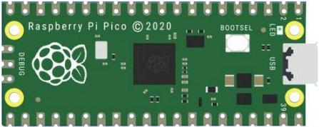|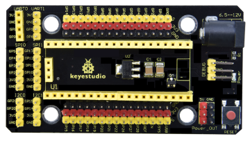|||
|-|-|-|-|
|树莓派Pico板*1|树莓派Pico板的扩展板*1|公对母杜邦线若干|USB 线*1|
|||||
|红色LED*1|220Ω电阻*1|面包板*1||

元件知识：

（1）LED:

LED是一种被称为“发光二极管”的半导体，是一种由半导体材料(硅、硒、锗等)制成的电子器件。它有正极和负极。短腿为负极，接GND，长腿为正极，接3.3V或5V。

（2）五色环电阻

电阻是电路中限制或调节电流流动的电子元件。左边是电阻器的外观，右边是电阻在电路中表示的符号。电阻(R)的单位为欧姆(Ω)，1 mΩ= 1000 kΩ，1kΩ= 1000Ω。

我们可以使用电阻来保护敏感组件，如LED。电阻的强度（以Ω为单位）用小色环标记在电阻器的主体上。每种颜色代表一个数字，你可以用电阻对照卡查找。

\-色带1 – 1st Digit.

-色带 2 – 2nd Digit.

-色带 3 – 3rd Digit.

-色带 4 – Multiplier.

-色带 5 – Tolerance.

在这个套件中，我们提供了3个具有不同电阻值的五色环电阻。这里以3个五色环电阻为例：

220Ω 电阻*10

10KΩ 电阻*10

1KΩ 电阻*10

在相同的电压下，会有更小的电流和更大的电阻。电流(I)、电压(U)、电阻(R)之间的联系可以用公式表示：I=U/R。在下图中，假如电压为3V，则通过R1的电流:
I = U / R = 3 V / 10 KΩ= 0.0003A= 0.3mA。

不要把电阻值很低的电阻直接连接在电源两极，这样会使电流过高而损坏电子元件。电阻是没有正负极之分。

（3）面包板

面包板是实验室中用于搭接电路的重要工具。面包板上有许多孔，可以插入集成电路和电阻等电路元件。熟练掌握面包板的使用方法是提高实验效率，减少实验故障出现几率的重要基础之一。下面就面包板的结构和使用方法做简单介绍。一个典型的面包板如下所示：

面包板的外观和内部结构如上图所示，常见的最小单元面包板分上、中、下三部分，上面和下面部分一般是由一行或两行的插孔构成的窄条，中间部分是由中间一条隔离凹槽和上下各5
行的插孔构成的条。

在面包板的两个窄条分别有两行插孔，两行之间是不连通的，一般是作为电源引入的通路。上方第一行标有“+”的一行有10组插孔（内部都是连通），均为正极；上方第二行标有“-”的一行有10组插孔，（内部都是连通），均为接地。面包板下方的第一行与第二行结构同上。如需用到整个面包板，通常将“+”与“+”用导线连接起来，“-”与“-”用导线连接起来。

　　中间部分宽条是由中间一条隔离凹槽和上下各5
行的插孔构成。在同一列中的5
个插孔是互相连通的，列和列之间以及凹槽上下部分则是不连通的。外观及结构如下图：

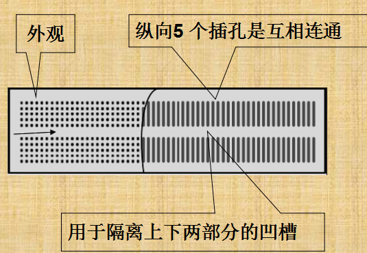

中间部分宽条的连接孔分为上下两部分，是面包板的主工作区，用来插接原件和跳线。在同一列中的5个插孔（即a-b-c-d-e，f-g-h-i-j）是互相连通的；列和列之间以及凹槽上下部分是不连通的。在做实验的时候，通常是使用两窄一宽组成的小单元，在宽条部分搭接电路的主体部分，上面的窄条取一行做电源，下面的窄条取一行做接地。中间宽条用于连接电路，由于凹槽上下是不连通的，所以集成块一般跨插在凹槽上。

（4）keyes 树莓派Pico板的扩展板使用方法

将树莓派Pico板堆叠在扩展板上即可使用，如下图：

（5）电源

在本项目中，用USB线将树莓派Pico板和电脑连起来。连接方法请参照文档：开发环境设置

项目电路图和接线图：

首先，切断树莓派Pico板的所有电源。然后根据电路图和接线图搭建电路。电路搭建好并验证无误后，用USB线将树莓派Pico板连接到电脑上。注意：避免任何可能的短路(特别是连接3.3V和GND)!

警告：短路可能导致电路中产生大电流，造成元件过热，并对硬件造成永久性损坏。

电路图

接线图

注意: 怎样连接LED

怎样识别五色环220Ω电阻

项目代码：

根据电路图，当树莓派Pico板的GP16输出高电平时，LED点亮；当输出低电平时，LED灯关闭。因此，我们可以通过控制GP16重复输出高低电平，使LED反复闪烁。

本项目中使用的代码保存在文件夹“3. Python 教程\1. Windows 系统\2.
项目课程”中。你可以把代码移到任何地方。例如，我们将“2.
项目课程”文件夹保存在Disk(D)中，路径为D:\2. 项目课程。

代码在线运行：

打开“Thonny”软件，点击“此电脑”→“D:”→“2. 项目课程”→“项目
03：外接灯闪烁”。

展开文件夹“项目
03：外接灯闪烁”，鼠标左键双击“Project_03_External_LED_flashing.py”打开它。如下图所示：

确保树莓派Pico板已经连接到电脑上。单击“停止/重启后端进程”，然后去看看“Shell”窗口将显示什么界面。

单击“运行当前脚本”，代码开始执行，电路中的LED开始闪烁。按“Ctrl+C”或单击“停止/重启后端进程”退出程序。

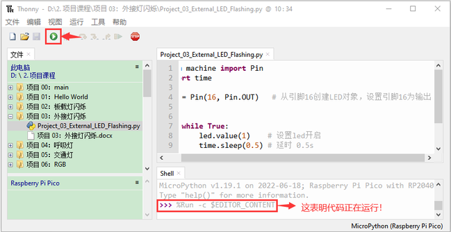

0.5秒

注意：这是在线运行的代码。如果断开USB线，重新启动“Raspberry Pi Pico”，LED停止闪烁。在Thonny软件的“Shell”窗口将显示如下信息：

代码离线运行（上传代码到Raspberry Pi Pico）：

确保树莓派Pico板已经连接到电脑上，单击“停止/重启后端进程”。

如下图所示，鼠标右键单击文件“Project_03_External_LED_flashing.py”，选择“上载到/”上传代码到Raspberry Pi Pico。

用同样的方法上传main.py

断开树莓派Pico板上的USB线并重新连接，电路中的LED会反复闪烁。

0.5秒

注意：这里的代码是离线运行的。如果你想停止离线运行并且在“Shell”窗口显示对应信息，只需单击Thonny软件中的“停止/重启后端进程”。

### 项目 04: 呼吸灯

项目介绍：

在之前的研究中，我们知道LED有亮/灭状态，那么如何进入中间状态呢?如何输出一个中间状态让LED“半亮”?这就是我们将要学习的。呼吸灯，即LED由灭到亮，再由亮到灭，就像“呼吸”一样。那么，如何控制LED的亮度呢?我们将使用树莓派Pico板的PWM来实现这个目标。

项目元件：

|||||
|-|-|-|-|
|树莓派Pico板*1|树莓派Pico板的扩展板*1|公对母杜邦线若干|USB 线*1|
|||||
|红色LED*1|220Ω电阻*1|面包板*1||

元件知识：

Analog & Digital

模拟信号在时间和数值上都是连续的信号。相反，数字信号或离散时间信号是由一系列数字组成的时间序列。生活中的大多数信号都是模拟信号。一个熟悉的模拟信号的例子是，全天的温度是如何不断变化的，而不是突然从0到10的瞬间变化。然而，数字信号的值可以瞬间改变。这个变化用数字表示为1和0(二进制代码的基础)。如下图所示，我们可以更容易地看出它们的差异。

在实际应用中，我们经常使用二进制作为数字信号，即一系列的0和1。由于二进制信号只有两个值(0或1)，因此具有很大的稳定性和可靠性。最后，可以将模拟信号和数字信号相互转换。

PWM：

脉宽调制(PWM)是一种利用数字信号控制模拟电路的有效方法。普通处理器不能直接输出模拟信号。PWM技术使这种转换(将数字信号转换为模拟信号)非常方便。PWM技术利用数字引脚发送一定频率的方波，即高电平和低电平的输出，交替持续一段时间。每一组高电平和低电平的总时间一般是固定的，称为周期(注:周期的倒数是频率)。高电平输出的时间通常称为脉宽，占空比是脉宽(PW)与波形总周期(T)之比的百分比。高电平输出持续时间越长，占空比越长，模拟信号中相应的电压也就越高。下图显示了对应于脉冲宽度0%-100%的模拟信号电压在0V-3.3V(高电平为3.3V)之间的变化情况.

PWM占空比越长，输出功率越高。既然我们了解了这种关系，我们就可以用PWM来控制LED的亮度或直流电机的速度等等。从上面可以看出，PWM并不是真实的模拟信号，电压的有效值等于相应的模拟信号。因此，我们可以控制LED和其他输出模块的输出功率，以达到不同的效果

树莓派Pico与 PWM

树莓派Pico板有16个PWM通道，每个PWM通道可以独立控制频率和占空比，时钟频率范围为7Hz到125MHz。树莓派Pico板上的每个引脚都可以配置为PWM输出。

项目电路图和接线图：

项目代码：

本项目设计使GP16输出PWM，脉宽由0%逐渐增加到100%，再由100%逐渐减小到0%。

本项目中使用的代码保存在文件夹“3. Python 教程\1. Windows 系统\2.
项目课程”中。你可以把代码移到任何地方。例如，我们将“2.
项目课程”文件夹保存在Disk(D)中，路径为D:\2. 项目课程。

打开“Thonny”软件，点击“此电脑”→“D:”→“2. 项目课程”→“项目
04：呼吸灯”。并鼠标左键双击“Project_04_Breathing_Led.py”。

项目现象：

确保树莓派Pico板已经连接到电脑上，单击“停止/重启后端进程”。

单击“运行当前脚本”，代码开始执行，你会看到的现象是：电路中的LED从暗逐渐变亮，再从亮逐渐变暗，就像呼吸一样。按“Ctrl+C”或单击“停止/重启后端进程”退出程序。

### 项目 05：交通灯

项目介绍：

交通灯在我们的日常生活中很普遍。根据一定的时间规律，交通灯是由红、黄、绿三种颜色组成的。每个人都应该遵守交通规则，这可以避免许多交通事故。在这个项目中，我们将使用树莓派Pico板和一些led(红，黄，绿)来模拟交通灯。

项目元件：

||||||
|-|-|-|-|-|
|树莓派Pico板*1|树莓派Pico板的扩展板*1|公对母杜邦线若干|红色LED*1|黄色 LED*1|
||||||
|绿色LED*1|USB 线*1|220Ω电阻*3|面包板*1|跳线若干|

项目电路图和接线图：

项目代码：

本项目中使用的代码保存在文件夹“3. Python 教程\1. Windows 系统\2.
项目课程”中。你可以把代码移到任何地方。例如，我们将“2.
项目课程”文件夹保存在Disk(D)中，路径为D:\2. 项目课程。

打开“Thonny”软件，点击“此电脑”→“D:”→“2.
项目课程”→“项目05：交通灯”。并鼠标左键双击“Project_05_Traffic_Lights.py”。

项目现象：

确保树莓派Pico板已经连接到电脑上，单击“停止/重启后端进程”。

单击“运行当前脚本”，代码开始执行，你会看到的现象是：1.首先，绿灯会亮5秒，然后熄灭；2.其次，黄灯会闪烁3次，然后熄灭；3.然后，红灯会亮5秒，然后熄灭；4.继续运行上述1-3个步骤。

按“Ctrl+C”或单击“停止/重启后端进程”退出程序。

### 项目 06: RGB LED

项目介绍：

RGB led由三种颜色(红、绿、蓝)组成，通过混合这三种基本颜色可以发出不同的颜色。在这个项目中，我们将向你介绍RGB LED，并向你展示如何使用树莓派Pico板控制RGB LED发出不同的颜色光。即使RGB LED是非常基本的，但这也是一个介绍自己或他人电子和编码基础的伟大方式。

项目元件：

|||||
|-|-|-|-|
|树莓派Pico板*1|树莓派Pico板的扩展板*1|公对母杜邦线若干|RGB LED*1|
|||||
|220Ω电阻*3|面包板*1|USB 线*1||

元件知识：

显示器大多遵循RGB颜色标准，电脑屏幕上的所有颜色都是由红、绿、蓝三种颜色以不同比例混合而成。

这个RGB LED有4个引脚，每个颜色(红，绿，蓝)和一个共同的阴极。为了改变RGB led的亮度，我们可以使用树莓派Pico板的PWM引脚。PWM引脚会给RGB led不同占空比的信号以获得不同的颜色。

如果我们使用3个10位PWM来控制RGBLED，理论上我们可以通过不同的组合创建210\*210\*210=
1,073,741,824(10亿)种颜色。

项目电路图和接线图：

注意：

RGB LED最长引脚(共阴极)连接GND。

怎样识别五色环220Ω电阻

项目代码：

本项目中使用的代码保存在文件夹“3. Python 教程\1. Windows 系统\2.
项目课程”中。你可以把代码移到任何地方。例如，我们将“2.
项目课程”文件夹保存在Disk(D)中，路径为D:\2. 项目课程。

打开“Thonny”软件，点击“此电脑”→“D:”→“2.
项目课程”→“项目06：RGB”。并鼠标左键双击“Project_06_RGB_LED.py”。

项目现象：

确保树莓派Pico板已经连接到电脑上，单击“停止/重启后端进程”。

单击“运行当前脚本”，代码开始执行，你会看到的现象是：RGB LED开始显示随机颜色。按“Ctrl+C”或单击“停止/重启后端进程”退出程序。

### 项目 07: 流水灯

项目介绍：

在日常生活中，我们可以看到许多由不同颜色的led组成的广告牌。他们不断地改变灯光(像流水一样)来吸引顾客的注意。在这个项目中，我们将使用树莓派Pico板控制10个leds实现流水的效果。

项目元件：

|||||
|-|-|-|-|
|树莓派Pico板*1|树莓派Pico板的扩展板*1|公对母杜邦线若干|红色LED*10|
|||||
|220Ω电阻*10|面包板*1|跳线若干|USB 线*1|

项目电路图和接线图:

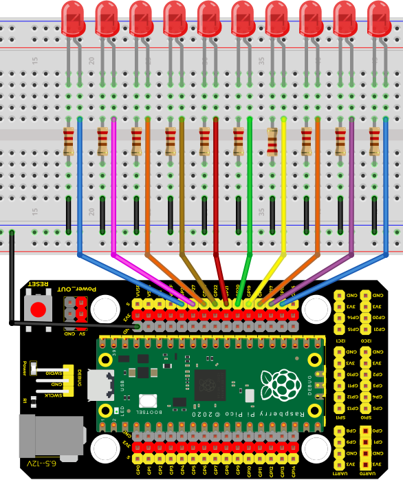

注意:

怎样连接LED

怎样识别五色环220Ω电阻

项目代码：

本项目是设计制作一个流水灯。这是这些行动：首先打开LED
\#1，然后关闭它。然后打开LED
\#2，然后关闭…并对所有10个LED重复同样的操作，直到最后一个LED关闭。这一过程反复进行，以实现流水的“运动”。

本项目中使用的代码保存在文件夹“3. Python 教程\1. Windows 系统\2.
项目课程”中。你可以把代码移到任何地方。例如，我们将“2.
项目课程”文件夹保存在Disk(D)中，路径为D:\2. 项目课程。

打开“Thonny”软件，点击“此电脑”→“D:”→“2. 项目课程”→“项目
07：流水灯”。并鼠标左键双击“Project_07_Flowing_Water_Light.py”。

项目现象：

确保树莓派Pico板已经连接到电脑上，单击“停止/重启后端进程”。

单击“运行当前脚本”，代码开始执行，你会看到的现象是：10个LED将从左到右点亮，然后从右到左返回。按“Ctrl+C”或点单击“停止/重启后端进程”退出程序。

### 项目 08: 一位数码管

项目介绍：

七段数码管是一种显示十进制数字的电子显示设备，广泛应用于数字时钟、电子仪表、基本计算器和其他显示数字信息的电子设备。甚至我们在电影中看到的炸弹也有七段数码管。也许七段数码管看起来不够现代，但它们是更复杂的点阵显示器的替代品，在有限的光线条件下和强烈的阳光下都很容易使用。在这个项目中，我们将使用树莓派Pico板控制一位数码管显示数字。

项目元件：

|||||
|-|-|-|-|
|树莓派Pico板*1|树莓派Pico板的扩展板*1|公对母杜邦线若干|一位数码管*1|
|||||
|220Ω电阻*8|面包板*1|USB 线*1||

元件知识：

一位数码管显示原理：数码管显示是一种半导体发光器件。它的基本单元是一个发光二极管(LED)。数码管显示根据段数可分为7段数码管和8段数码管。8段数码管比7段多一个LED单元(用于小数点显示)。七段LED显示屏的每段是一个单独的LED。根据LED单元接线方式，数码管可分为共阳极数码管和共阴极书案管。

在共阴极7段数码管中，分段LED的所有阴极(或负极)都连接在一起，你应该把共阴极连接到GND，要点亮一个分段LED，你可以将其关联的引脚设置为HIGH。

在共阳极7段数码管中，所有段的LED阳极(正极)都连接在一起，你应该把共阳极连接到+5V。要点亮一个分段LED，你可以将其关联的引脚设置为LOW。

数码管的每个部分由一个LED组成。所以当你使用它的时候，你也需要使用一个限流电阻。否则，LED会被烧坏。在这个实验中，我们使用了一个普通的共阴极一位数码管。正如我们上面提到的，你应该将公共阴极连接到GND。要点亮一个分段LED，你可以将其关联的引脚设置为HIGH。

项目电路图和接线图：

注意：插入面包板的七段数码管方向与接线图一致，右下角多一个点。

项目代码：

数字显示分7段，小数点显示分1段。当显示某些数字时，相应的段将被点亮。例如，当显示数字1时，b和c段将被打开。

本项目中使用的代码保存在文件夹“3. Python 教程\1. Windows 系统\2.
项目课程”中。你可以把代码移到任何地方。例如，我们将“2.
项目课程”文件夹保存在Disk(D)中，路径为D:\2. 项目课程。

打开“Thonny”软件，点击“此电脑”→“D:”→“2. 项目课程”→“项目
08：一位数码管”。并鼠标左键双击“Project_08_One_Digit_Digital_Tube.py”。

项目现象：

确保树莓派Pico板已经连接到电脑上，单击“停止/重启后端进程”。

单击“运行当前脚本”，代码开始执行，你会看到的现象是：一位数码管将显示从9到0的数字。按“Ctrl+C”或单击“停止/重启后端进程”退出程序。

### 项目 09：四位数码管

项目介绍：

四位数码管是一种非常实用的显示器件，电子时钟的显示，球场上的记分员，公园里的人数都是需要的。由于价格低廉，使用方便，越来越多的项目将使用4位数码管。在这个项目中，我们使用树莓派Pico板控制四位数码管来显示数字。

项目元件：

|||||
|-|-|-|-|
|树莓派Pico板*1|树莓派Pico板的扩展板*1|220Ω 电阻*8|四位数码管*1|
|||||
|面包板*1|公对母杜邦线若干|USB 线*1||

元件知识：

四位数码管：四位数码管有共阳极和共阴极两种四位数码管，显示原理是和一位数码管是类似的，都是8个GPIO口控制数码管的显示段，就是8个led灯，不过，这里是4位的，所以就还需要4个GPIO口来控制位选择端，就是选择哪个单个数码管亮，位的切换很快，肉眼区分不出来，就能看起来是多个数码管同时显示的了。

我们的四位数码管是共阴极的。

下图为4位数码管的引脚图，G1、G2、G3、G4就是控制位的引脚。

下图为4位数码管内部布线原理图

项目电路图和接线图：

项目代码：

本项目中使用的代码保存在文件夹“3. Python 教程\1. Windows 系统\2.
项目课程”中。你可以把代码移到任何地方。例如，我们将“2.
项目课程”文件夹保存在Disk(D)中，路径为D:\2. 项目课程。

打开“Thonny”软件，点击“此电脑”→“D:”→“2. 项目课程”→“项目
09：四位数码管”。然后鼠标左键双击“Project_09_Four_Digit_Digital_Tube.py”。

项目现象：

确保树莓派Pico板已经连接到电脑上，单击“停止/重启后端进程”。

单击“运行当前脚本”，代码开始执行，你会看到的现象是：四位数码管显示数字，并在一个无限循环中重复这些动作。按“Ctrl+C”或单击“停止/重启后端进程”退出程序。

### 项目 10：8×8 点阵显示

项目介绍：

点阵屏是一种电子数字显示设备，可以显示机器、钟表、公共交通离场指示器和许多其他设备上的信息。在这个项目中，我们将使用树莓派Pico板控制8x8 LED点阵来逐渐点亮点阵。

项目元件：

|||||
|-|-|-|-|
|树莓派Pico板*1|树莓派Pico板的扩展板*1|8*8点阵屏*1|USB 线*1|
|||||
|公对母杜邦线若干|220Ω 电阻*8|面包板*1||

元件知识：

8\*8LED Matrix：8\*8点阵，就是由64个led灯组成，有行共阳极和行共阴极两种，我们的模块是行共阳极的，也就是每一行有一条线将LED的正极连到一起，列就是将LED灯的负极连接到一起，看下图：

项目电路图和接线图：

项目代码：

本项目中使用的代码保存在文件夹“3. Python 教程\1. Windows 系统\2.
项目课程”中。你可以把代码移到任何地方。例如，我们将“2.
项目课程”文件夹保存在Disk(D)中，路径为D:\2. 项目课程。

打开“Thonny”软件，点击“此电脑”→“D:”→“2. 项目课程”→“项目 10：8×8
点阵显示”。然后鼠标左键双击“Project_10_8×8_Dot_Matrix_Display.py”。

项目现象：

确保树莓派Pico板已经连接到电脑上，单击“停止/重启后端进程”。

单击“运行当前脚本”，代码开始执行，你会看到的现象是：8\*8点阵屏显示字符“A”1S、显示字符“B”1S、显示字符“C”1S，然后滚屏显示字符串“Hello World”，反复循环。按“Ctrl+C”或单击“停止/重启后端进程”退出程序。

### 项目 11：74HC595N 控制 8 个LED

项目介绍：

在之前的项目中，我们已经学过了怎样点亮一个LED。

树莓派Pico板上只有26个IO端口，我们如何点亮大量的led呢?
有时可能会耗尽树莓派Pico板上的所有引脚，这时候就需要用移位寄存器扩展它。你可以使用74HC595N芯片一次控制8个输出，而只占用你的微控制器上的几个引脚。你还可以将多个寄存器连接在一起，以进一步扩展输出，在这个项目中，我们将使用树莓派Pico板，74HC595芯片和LED制作一个流水灯来了解74HC595芯片的功能。

项目元件：

|||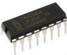|
|-|-|-|
|树莓派Pico板*1|树莓派Pico板的扩展板*1|74HC595N芯片*1|
||||
|220Ω电阻*8|面包板*1|跳线若干|
||||
|红色LED*8|USB 线*1|公对母杜邦线若干|

元件知识：

74HC595N芯片：简单来说就是具有8
位移位寄存器和一个存储器，以及三态输出功能。移位寄存器和存储器同步于不同的时钟，数据在移位寄存器时钟SCK的上升沿输入，在存储寄存器时钟RCK的上升沿进入的存储寄存器中去。如果两个时钟连在一起，则移位寄存器总是比存储寄存器早一个脉冲。移位寄存器有一个串行移位输入端（SI）和一个用于级联的串行输出端（SQH）,8位移位寄存器可以异步复位（低电平复位），存储寄存器有一个8位三态并行的总线输出，当输出使能（OE）被使能（低电平有效）将存储寄存器中输出至74HC595N的引脚（总线）。

引脚说明：

|13引脚OE|是一个输出使能引脚，用于确保锁存器的数据是否输入到Q0-Q7引脚。在低电平时，不输出高电平。在本实验中，我们直接连接GND，保持低电平输出数据。|
|-|-|
|14引脚SI|这是74HC595接收数据的引脚，即串行数据输入端，一次只能输入一位，那么连续输入8次，就可以组成一个字节了。|
|10引脚SCLR|一个初始化存储寄存器管脚的管脚。在低电平时初始化内部存储寄存器。在这个实验中，我们连接VCC以保持高水平。|
|11引脚SCK|移位寄存器的时钟引脚，上升沿时，移位寄存器中的数据整体后移，并接收新的数据输入|
|12引脚RCK|存储寄存器的时钟输入引脚。上升沿时，数据从移位寄存器转存到存储寄存器中。这时数据就从Q0~Q7端口并行输出。|
|9引脚SQH|引脚是一个串行输出引脚，专门用于芯片级联，接下一个74HC595的SI端|
|Q0--Q7(15引脚，1-7引脚)|八位<a href="https://baike.baidu.com/item/%E5%B9%B6%E8%A1%8C/5806759">并行</a>输出端，可以直接控制数码管的8个段|

项目电路图和接线图：

注意：需要注意74HC595N芯片插入的方向

项目代码：

本项目中使用的代码保存在文件夹“3. Python 教程\1. Windows 系统\2.
项目课程”中。你可以把代码移到任何地方。例如，我们将“2.
项目课程”文件夹保存在Disk(D)中，路径为D:\2. 项目课程。

打开“Thonny”软件，点击“此电脑”→“D:”→“2. 项目课程”→“项目 11：74HC595N
控制 8 个LED”。选择“my74HC595.py”，鼠标右键单击选择
“上载到/”，等待“my74HC595.py”被上传到Raspberry Pi Pico，然后鼠标左键双击“Project_11_74HC595N_Controls_8_LEDs.py”。

项目现象：

确保树莓派Pico板已经连接到电脑上，单击“停止/重启后端进程”。

单击“运行当前脚本”，代码开始执行，你会看到的现象是：8个LED开始以流水模式闪烁。按“Ctrl+C”或单击“停止/重启后端进程”退出程序。

### 项目 12：有源蜂鸣器

项目介绍：

有源蜂鸣器是一个发声组件。它被广泛用作电脑、打印机、报警器、电子玩具、电话、计时器等的发声元件。它有一个内在的振动源，只需连接5V电源，即可持续发出嗡嗡声。在这个项目中，我们将使用树莓派Pico板控制有源蜂鸣器发出“滴滴”声。

项目元件：

||||
|-|-|-|
|树莓派Pico板*1|树莓派Pico板的扩展板*1|面包板*1|
||||
|NPN型晶体管(S8050)*1|1kΩ电阻*1|跳线若干|
||||
|有源蜂鸣器*1|USB 线*1|公对母杜邦线若干|

元件知识：

有源蜂鸣器内部有一个简单的振荡器电路，可以将恒定的直流电转换成特定频率的脉冲信号。一旦有源蜂鸣器收到一个高电平，它将产生声音。而无源蜂鸣器是一种内部没有振动源的集成电子蜂鸣器，它必须由2K-5K方波驱动，而不是直流信号。这两个蜂鸣器的外观非常相似，但是一个带有绿色电路板的蜂鸣器是无源蜂鸣器，而另一个带有黑色胶带的是有源蜂鸣器。无源蜂鸣器不能区分正极性而有源极性蜂鸣器是可以。如下所示：

晶体管:
由于蜂鸣器需要很大的电流，ESP32输出能力的GPIO不能满足要求，这里需要一个NPN型晶体管来放大电流。晶体管，全称:半导体晶体管，是一种控制电流的半导体器件。晶体管可以用来放大微弱信号，也可以用作开关。它有三个电极(pin)：基极(b)，集电极(c)和发射极(e)。当电流通过“be”之间时，“ce”将允许几倍的电流通过(晶体管放大)，此时，晶体管在放大区工作。当“be”之间的电流超过某个值时，“ce”将不再允许电流增加，此时晶体管工作在饱和区。晶体管有两种类型如下所示：PNP和NPN

PNP晶体管 NPN晶体管

在我们的套件中，PNP晶体管标记为8550,NPN晶体管标记为8050。

基于晶体管的特性，它常被用作数字电路中的开关。由于单片机输出电流的能力很弱，我们将使用晶体管来放大电流和驱动大电流的元件。在使用NPN晶体管驱动蜂鸣器时，通常采用以下方法：如果GPIO输出高电平，电流将流过R1，晶体管将传导，蜂鸣器将发出声音。如果GPIO输出低电平，没有电流流过R1，晶体管就不会传导，蜂鸣器也不会响。在使用PNP晶体管驱动蜂鸣器时，通常采用以下方法：如果GPIO输出低电平，电流将流过R1，晶体管将传导，蜂鸣器将发出声音。如果GPIO输出高电平，没有电流流过R1，晶体管就不会传导，蜂鸣器也不会响。

项目电路图和接线图：

注意：
1.该电路中蜂鸣器的电源为5V。在3.3V的电源下，蜂鸣器可以工作，但会降低响度。

2.VUSB应连接到USB线的正极，如果它连接到GND，它可能烧坏电脑或树莓派Pico板。同样，树莓派Pico板的36-40引脚接线时也要小心，避免短路。

3.有源蜂鸣器正极(“+”/长引脚)接引脚16，负极（短引脚）接GND。

项目代码：

本项目中使用的代码保存在文件夹“3. Python 教程\1. Windows 系统\2.
项目课程”中。你可以把代码移到任何地方。例如，我们将“2.
项目课程”文件夹保存在Disk(D)中，路径为D:\2. 项目课程。

打开“Thonny”软件，点击“此电脑”→“D:”→“2. 项目课程”→“项目
12：有源蜂鸣器”。并鼠标左键双击“Project_12_Active_Buzzer.py”。

项目现象：

确保树莓派Pico板已经连接到电脑上，单击“停止/重启后端进程”。

单击“运行当前脚本”，代码开始执行，你会看到的现象是：有源蜂鸣器发出“滴滴”声。按“Ctrl+C”或单击“停止/重启后端进程”退出程序。

### 项目 13：无源蜂鸣器

项目介绍：

在之前的项目中，我们研究了有源蜂鸣器，它只能发出一种声音，可能会让你觉得很单调。这个项目将学习另一种蜂鸣器，无源蜂鸣器。与有源蜂鸣器不同，无源蜂鸣器可以发出不同频率的声音。在这个项目中，你将使用树莓派Pico板控制无源蜂鸣器发出警报声。

项目元件：

||||
|-|-|-|
|树莓派Pico板*1|树莓派Pico板的扩展板*1|面包板*1|
||||
|NPN型晶体管(S8050)*1|1kΩ电阻*1|跳线若干|
||||
|无源蜂鸣器*1|USB 线*1|公对母杜邦线若干|

元件知识：

无源蜂鸣器是一种内部没有振动源的集成电子蜂鸣器。它必须由2K-5K方波驱动，而不是直流信号。这两个蜂鸣器的外观非常相似，但是一个带有绿色电路板的蜂鸣器是无源蜂鸣器，而另一个带有黑色胶带的是有源蜂鸣器。无源蜂鸣器不能区分正极性而有源极性蜂鸣器是可以。

晶体管: 请参考项目12.

项目电路图和接线图:

项目代码：

本项目中使用的代码保存在文件夹“3. Python 教程\1. Windows 系统\2.
项目课程”中。你可以把代码移到任何地方。例如，我们将“2.
项目课程”文件夹保存在Disk(D)中，路径为D:\2. 项目课程。

打开“Thonny”软件，点击“此电脑”→“D:”→“2. 项目课程”→“项目
13：无源蜂鸣器”。并鼠标左键双击“Project_13_Passive_Buzzer.py”。

项目现象：

确保树莓派Pico板已经连接到电脑上，单击“停止/重启后端进程”。

单击“运行当前脚本”，代码开始执行，你会看到的现象是：无源蜂鸣器发出警报声。按“Ctrl+C”或单击“停止/重启后端进程”退出程序。

### 项目 14: 小台灯

项目介绍：

你知道树莓派Pico可以在你按下按键的时候点亮LED吗?
在这个项目中，我们将使用树莓派Pico板，一个按键开关和一个LED来制作一个迷你台灯。

项目代码：

||||||
|-|-|-|-|-|
|树莓派Pico板*1|树莓派Pico板的扩展板*1|按键*1|红色 LED*1|10KΩ电阻*1|
||||||
|面包板*1|220Ω电阻*1|USB 线*1|公对母杜邦线若干|按键帽*1|

元件知识：

按键：按键可以控制电路的通断，把按键接入电路中，不按下按键的时候电路是断开的，

一按下按键电路就通啦，但是松开之后就又断了。可是为什么按下才通电呢？这得从按键的内部构造说起。没按下之前，电流从按键的一端过不去另一端；按下的时候，按键内部的金属片把两边连接起来让电流通过。

按键内部结构如图：，未按下按键之前，1、2就是导通的，3、4也是导通的，但是1、3或1、4或2、3或2、4是断开（不通）的；只有按下按键时，1、3或1、4或2、3或2、4才是导通的。

在设计电路时，按键开关是最常用的一种元件。

按键的原理图:     

  
什么是按键抖动？

我们想象的开关电路是“按下按键-立刻导通”“再次按下-立刻断开”，而实际上并非如此。

按键通常采用机械弹性开关，而机械弹性开关在机械触点断开闭合的瞬间（通常
10ms左右），会由于弹性作用产生一系列的抖动，造成按键开关在闭合时不会立刻稳定的接通电路，在断开时也不会瞬时彻底断开。

那又如何消除按键抖动呢？

常用除抖动方法有两种：软件方法和硬件方法。这里重点讲讲方便简单的软件方法。

我们已经知道弹性惯性产生的抖动时间为10ms
左右，用延时命令推迟命令执行的时间就可以达到除抖动的效果。

所以我们在代码中加入了0.02秒的延时以实现按键防抖的功能。

项目电路图和接线图：

注意:

怎样连接LED

怎样识别五色环220Ω电阻和五色环10KΩ电阻

项目代码：

本项目中使用的代码保存在文件夹“3. Python 教程\1. Windows 系统\2.
项目课程”中。你可以把代码移到任何地方。例如，我们将“2.
项目课程”文件夹保存在Disk(D)中，路径为D:\2. 项目课程。

打开“Thonny”软件，点击“此电脑”→“D:”→“2. 项目课程”→“项目
14：小台灯”。并鼠标左键双击“Project_14_Mini_Table_Lamp.py”。

项目现象：

确保树莓派Pico板已经连接到电脑上，单击“停止/重启后端进程”。

单击“运行当前脚本”，代码开始执行，你会看到的现象是：按下按钮，LED亮起；当按钮松开时，LED仍亮着。再次按下按钮，LED熄灭；当按钮释放时，LED保持关闭。是不是很像个小台灯？按“Ctrl+C”或单击“停止/重启后端进程”退出程序。

### 项目 15：模拟沙漏

项目介绍：

古代人没有电子时钟，就发明了沙漏来测时间，沙漏两边的容量比较大，在一边装了细沙，中间有个很小的通道，将沙漏直立，有细沙的一边在上方，由于重力的作用，细沙就会往下流通过通道到沙漏的另一边，当细沙都流到下边了，就倒过来，把一天反复的次数记录下来，第二天就可以通过沙漏反复流动的次数而知道这一天大概的时间了。这一课我们将利用树莓派Pico板控制倾斜开关和LED灯来模拟沙漏，制作一个电子沙漏。

项目元件：

|||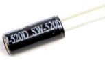||
|-|-|-|-|
|树莓派Pico板*1|树莓派Pico板的扩展板*1|倾斜开关*1|红色 LED*4|
|||||
|面包板*1|220Ω电阻*4|USB 线*1||
|||||
|10KΩ电阻*1|跳线若干|公对母杜邦线若干||

元件知识：

倾斜开关也叫数字开关。里面有一个可以滚动的金属球。采用金属球滚动与底部导电板接触的原理来控制电路的通断。当倾斜开关是滚珠型倾斜感应单方向性触发开关，当倾斜传感器向触发端（两根金属脚端）倾斜时，倾斜开关处于闭路状态，模拟端口的电压约为5V(二进制数为1023)。这样，LED会亮起。当倾斜开关在水平位置或向另一端倾斜时，倾斜开关处于开路状态，模拟端口的电压约为0V(0二进制)。LED将会关闭。在程序中，我们根据模拟端口的电压值，是否大于2.5V(512二进制)来判断开关是开还是关。

这里用倾斜开关的内部结构来说明它是如何工作的，显示如下图：

项目电路图和接线图：

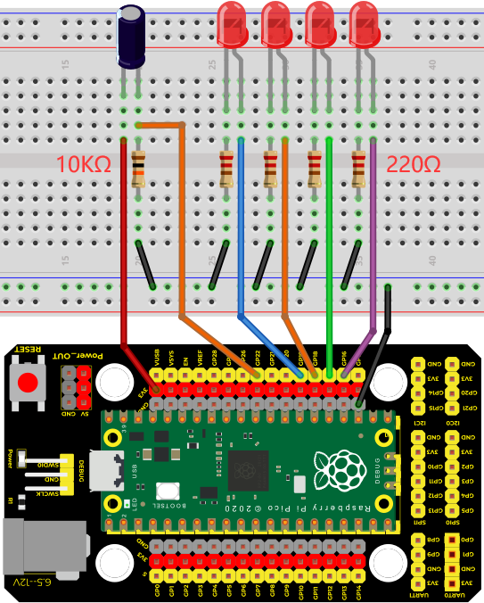

注意: 怎样连接LED

怎样识别五色环220Ω电阻和五色环10KΩ电阻

项目代码：

本项目中使用的代码保存在文件夹“3. Python 教程\1. Windows 系统\2.
项目课程”中。你可以把代码移到任何地方。例如，我们将“2.
项目课程”文件夹保存在Disk(D)中，路径为D:\2. 项目课程。

打开“Thonny”软件，点击“此电脑”→“D:”→“2. 项目课程”→“项目
15：模拟沙漏”。并鼠标左键双击“Project_15_Tilt_And_LED.py”。

项目结果：

确保树莓派Pico板已经连接到电脑上，单击“停止/重启后端进程”。

单击“运行当前脚本”，代码开始执行，你会看到的现象是：将面包板倾斜到一定角度，led就会一个一个地亮起来。当回到上一个角度时，led会一个一个关闭。就像沙漏一样，随着时间的推移，沙子漏了出来。按“Ctrl+C”或单击“停止/重启后端进程”退出程序。

### 项目 16： I2C 128×32 LCD

项目介绍：

在生活中，我们可以利用显示器等模块来做各种实验。你也可以DIY各种各样的小物件。例如，用一个温度传感器和显示器做一个温度测试仪，或者用一个超声波模块和显示器做一个距离测试仪。下面，我们将使用LCD_128X32_DOT模块作为显示器，将其连接到树莓派Pico板上。将使用树莓派Pico板控制LCD_128X32_DOT显示屏显示各种英文文字、常用符号和数字。

项目元件： 

||||
|-|-|-|
|树莓派Pico板*1|LCD_128X32_DOT*1|树莓派Pico板的扩展板*1|
||||
|4P 转杜邦线母单*1|USB 线*1||

元件知识：

LCD_128X32_DOT：一个像素为128\*32的液晶屏模块，它的驱动芯片为ST7567A。模块使用IIC通信方式，同时，代码中包含所有英文字母和常用符号的库，可以直接调用。使用时，我们还可以在代码中设置，让英文字母和符号显示不同文字大小。为了方便设置图案显示，我们还提供一个取模软件，可将特定的图案转化成控制代码，然后直接复制到测试代码中使用的。

LCD_128X32_DOT原理图：

LCD_128X32_DOT技术参数：

显示像素：128\*32 字符

芯片工作电压：4.5 ~ 5.5V

工作电流：100mA (5.0V)

模块最佳工作电压：5.0V

项目接线图：

项目代码：

本项目中使用的代码保存在文件夹“3. Python 教程\1. Windows 系统\2.
项目课程”中。你可以把代码移到任何地方。例如，我们将“2.
项目课程”文件夹保存在Disk(D)中，路径为D:\2. 项目课程。

打开“Thonny”软件，点击“此电脑”→“D:”→“2. 项目课程”→“项目 16： I2C 128×32 LCD”。分别选择“lcd128_32.py”和 “lcd128_32_fonts.py”，右键单击鼠标选择
“上载到/”，等待“lcd128_32.py”和 “lcd128_32_fonts.py”被上传到Raspberry Pi Pico，并鼠标左键双击“Project_16_I2C_128_32_LCD.py”。

项目现象：

确保树莓派Pico板已经连接到电脑上，单击“停止/重启后端进程”。

单击“运行当前脚本”，代码开始执行，你会看到的现象是：128X32LCD模块显示屏第一行显示“keyes”、第二行显示“ABCDEFGHIJKLMNOPQR”、第三行显示“123456789+-\*/\<\>=$@”、第四行显示“%^&(){}:;'|?,.~\\\[\]”。按“Ctrl+C”或单击“停止/重启后端进程”退出程序。

### 项目 17：小风扇

项目介绍：

在炎热的夏季，需要电扇来给我们降温，那么在这个项目中，我们将使用树莓派Pico板控制直流电机模块和小扇叶来制作一个小电扇。

项目元件：

|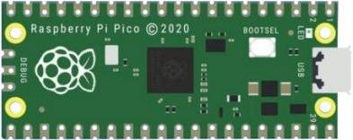||||
|-|-|-|-|
|树莓派Pico板*1|树莓派Pico板的扩展板*1|跳线若干|S8050三极管*1|
|||||
|二极管*1|面包板*1|USB 线*1|S8550三极管*1|
|||||
|直流电机*1|风扇片*1|公对母杜邦线若干||

项目电路图和接线图1：

（这个实验是使用S8050（NPN型三极管）控制电机）

项目代码1：

本项目中使用的代码保存在文件夹“3. Python 教程\1. Windows 系统\2.
项目课程”中。你可以把代码移到任何地方。例如，我们将“2.
项目课程”文件夹保存在Disk(D)中，路径为D:\2. 项目课程。

打开“Thonny”软件，点击“此电脑”→“D:”→“2. 项目课程”→“项目
17：小风扇”。并鼠标左键双击“Project_17.1\_ Small_Fan.py”。

项目现象1：

确保树莓派Pico板已经连接到电脑上，单击“停止/重启后端进程”。

单击“运行当前脚本”，代码开始执行，你会看到的现象是：将小风扇片安装到直流电机上，上电后，可以看到电机转动4秒，停止2秒，以此规律重复执行。按“Ctrl+C”或单击“停止/重启后端进程”退出程序。

项目电路图和接线图2：

（这个实验是使用S8550（PNP型三极管）控制电机）

项目代码2：

本项目中使用的代码保存在文件夹“3. Python 教程\1. Windows 系统\2.
项目课程”中。你可以把代码移到任何地方。例如，我们将“2.
项目课程”文件夹保存在Disk(D)中，路径为D:\2. 项目课程。

打开“Thonny”软件，点击“此电脑”→“D:”→“2. 项目课程”→“项目
17：小风扇”。并鼠标左键双击“Project_17.2\_ Small_Fan.py”。

项目现象2：

确保树莓派Pico板已经连接到电脑上，单击“停止/重启后端进程”。

单击“运行当前脚本”，代码开始执行，你会看到的现象是：将小风扇片安装到直流电机上，上电后，可以看到电机转动4秒，停止2秒，以此规律重复执行。按“Ctrl+C”或单击“停止/重启后端进程”退出程序。

### 项目 18：调光灯

项目介绍：

电位器是一个带有滑动或旋转触点的三端电阻器，它形成一个可调的分压器。它的工作原理是在均匀电阻上改变滑动触点的位置。在电位器中，整个输入电压被施加到电阻的整个长度上，输出电压是固定触点和滑动触点之间的电压值。在这个项目中，我们将学习使用树莓派Pico板读取电位器的值，并结合LED制作一个调光灯。

项目元件：

|||||
|-|-|-|-|
|树莓派Pico板*1|树莓派Pico板的扩展板*1|可调电位器*1|红色 LED*1|
|||||
|面包板*1|220Ω电阻*1|公对母杜邦线若干|USB 线*1|

元件知识：

可调电位器：可调电位器是电阻和模拟电子元件的一种，具有0和1两种状态(高电平和低电平)。模拟值不同，其数据状态呈现为1
~ 1024等线性状态。

读取电位器的ADC值和电压值：

我们将电位器连接到树莓派Pico板的模拟IO口上来读取电位器的ADC值和电压值。接线请参照以下接线图：

本项目中使用的代码保存在文件夹“3. Python 教程\1. Windows 系统\2.
项目课程”中。你可以把代码移到任何地方。例如，我们将“2.
项目课程”文件夹保存在Disk(D)中，路径为D:\2. 项目课程。

打开“Thonny”软件，点击“此电脑”→“D:”→“2. 项目课程”→“项目
18：调光灯”。并鼠标左键双击“Project_18.1_Read_Potentiometer_Analog_Value.py”。

确保树莓派Pico板已经连接到电脑上，单击“停止/重启后端进程”。

单击“运行当前脚本”，代码开始执行，你会看到的现象是：Thonny IDE下的“Shell”窗口将打印出电位器的ADC值和电压值，转动电位器手柄时，ADC值和电压值发生变化。按“Ctrl+C”或单击“停止/重启后端进程”退出程序。

调光灯的电路图和接线图：

在前面一步，我们读取了电位器的ADC值和电压值，现在我们需要将电位器的ADC值转换成LED的亮度，来做成一个亮度可调的灯。见如下所示接线图：

项目代码：

本项目中使用的代码保存在文件夹“3. Python 教程\1. Windows 系统\2.
项目课程”中。你可以把代码移到任何地方。例如，我们将“2.
项目课程”文件夹保存在Disk(D)中，路径为D:\2. 项目课程。

打开“Thonny”软件，点击“此电脑”→“D:”→“2. 项目课程”→“项目
18：调光灯”。并鼠标左键双击“Project_18.2_Dimming_Light.py”。

项目现象：

确保树莓派Pico板已经连接到电脑上，单击“停止/重启后端进程”。

单击“运行当前脚本”，代码开始执行，你会看到的现象是：转动电位器手柄，LED的亮度会相应地改变。按“Ctrl+C”或单击“停止/重启后端进程”退出程序。

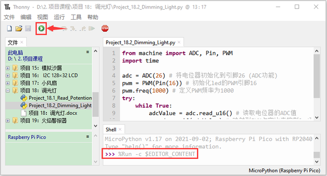

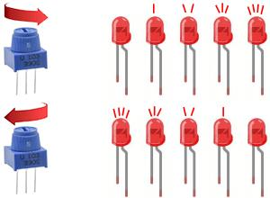

### 项目 23：火焰警报器

项目介绍：

火灾是一种可怕的灾害，火灾报警系统在房屋，商业建筑和工厂中是非常有用的。在本项目中，我们将使用树莓派Pico板控制火焰传感器，蜂鸣器和LED来模拟火灾报警装置。这是一个有意义的创客活动。

项目元件：

||||||
|-|-|-|-|-|
|树莓派Pico板*1|树莓派Pico板的扩展板*1|火焰传感器*1|红色 LED*1|有源蜂鸣器*1|
||||||
|面包板*1|220Ω电阻*1|10KΩ电阻*1|跳线若干|USB 线*1|
||||||
|NPN型晶体管(S8050)*1|1kΩ电阻*1|公对母杜邦线若干|||

元件知识：

火焰会发出一定程度的IR光，这种光人眼是看不到的，但我们的火焰传感器可以检测到它，并提醒微控制器（如树莓派Pico板）已经检测到火灾。它有一个专门设计的红外接收管来探测火焰，然后将火焰亮度转换为波动水平信号。接收三极管的短引脚是负极，另一个长引脚是正极。我们应该连接短引脚（负极)到5V，连接长引脚(正极)到模拟引脚，一个电阻和GND。如下图所示：

注意：火焰传感器应避开日光、汽车头灯、白炽灯直接照射，也不能对着热源(如暖气片、加热器)或空调，以避免环境温度较大的变化而造成误报。同时还易受射频辐射的干扰。

读取火焰传感器模拟值：

我们首先用一个简单的代码来读取火焰传感器的模拟值，并将其打印出来。接线请参照以下接线图：

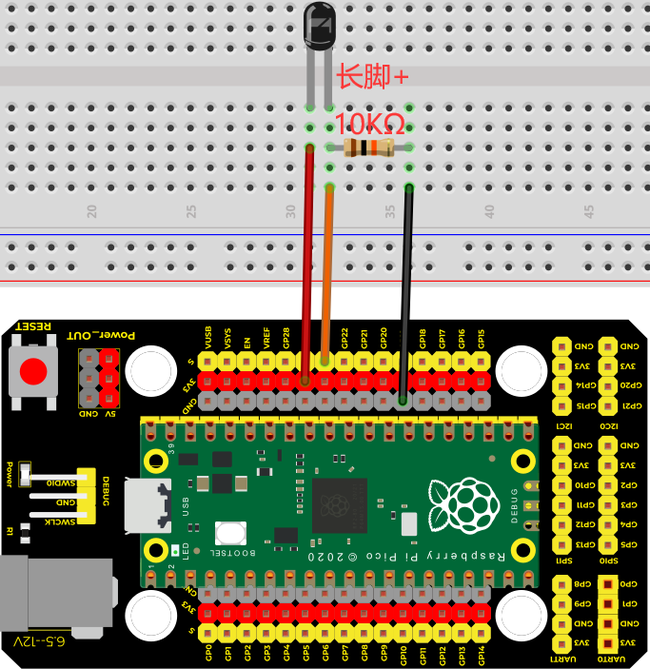

本项目中使用的代码保存在文件夹“3. Python 教程\1. Windows 系统\2.
项目课程”中。你可以把代码移到任何地方。例如，我们将“2.
项目课程”文件夹保存在Disk(D)中，路径为D:\2. 项目课程。

打开“Thonny”软件，点击“此电脑”→“D:”→“2. 项目课程”→“项目
19：火焰警报器”。并鼠标左键双击“Project_19.1_Read_Analog_Value.py”。

确保树莓派Pico板已经连接到电脑上，单击“停止/重启后端进程”。

单击“运行当前脚本”，代码开始执行，你会看到的现象是：Thonny IDE下的”Shell”窗口将打印火焰传感器读取的模拟值，当火焰靠近火焰传感器时，模拟值增大；反之，模拟值减小。按“Ctrl+C”或单击“停止/重启后端进程”退出程序。

火焰报警的电路图和接线图：

接下来，我们将使用火焰传感器和蜂鸣器、LED制作一个有趣的项目——火灾报警装置。当火焰传感器检测到火焰时，LED闪烁，蜂鸣器报警。

项目代码：（注意：代码中的阀值500可以根据实际情况自己重新设置）

本项目中使用的代码保存在文件夹“3. Python 教程\1. Windows 系统\2.
项目课程”中。你可以把代码移到任何地方。例如，我们将“2.
项目课程”文件夹保存在Disk(D)中，路径为D:\2. 项目课程。

打开“Thonny”软件，点击“此电脑”→“D:”→“2. 项目课程”→“项目
19：火焰警报器”。并鼠标左键双击“Project_19.2_Flame_Alarm.py”。

项目现象：

确保树莓派Pico板已经连接到电脑上，单击“停止/重启后端进程”。

单击“运行当前脚本”，代码开始执行，你会看到的现象是：当火焰传感器检测到火焰时，LED闪烁，蜂鸣器报警；否则，LED不亮，蜂鸣器不响。按“Ctrl+C”或单击“停止/重启后端进程”退出程序。

### 项目 20：小夜灯

项目介绍：

传感器或元件在我们的日常生活中是无处不在的。例如，一些公共路灯在晚上会自动亮起，而在白天会自动熄灭。为什么呢?
事实上，这些都是利用了一种光敏元件，可以感应外部环境光强度的元件。晚上，当室外亮度降低时，路灯会自动打开；到了白天，路灯会自动关闭。这其中的原理是很简单的，在本实验中我们使用树莓派Pico板控制LED就来实现这个路灯的效果。

项目元件：

||||||
|-|-|-|-|-|
|树莓派Pico板*1|树莓派Pico板的扩展板*1|光敏电阻*1|红色 LED*1|10KΩ电阻*1|
||||||
|面包板*1|公对母杜邦线若干|跳线若干|USB 线*1|220Ω电阻*1|

元件知识：

光敏电阻：是一种感光电阻，其原理是光敏电阻表面上接收亮度(光)降低电阻，光敏电阻的电阻值会随着被探测到的环境光的强弱而变化。有了这个特性，我们可以使用光敏电阻来检测光强。光敏电阻及其电子符号如下：

下面的电路是用来检测光敏电阻电阻值的变化：

在上述电路中，当光敏电阻的电阻因光强的变化而改变时，光敏电阻与电阻R2之间的电压也会发生变化。因此，通过测量这个电压就可以得到光的强度。

读取光敏电阻的模拟值：

我们首先用一个简单的代码来读取光敏电阻模拟值，并将其打印出来。接线请参照以下接线图：

本项目中使用的代码保存在文件夹“3. Python 教程\1. Windows 系统\2.
项目课程”中。你可以把代码移到任何地方。例如，我们将“2.
项目课程”文件夹保存在Disk(D)中，路径为D:\2. 项目课程。

打开“Thonny”软件，点击“此电脑”→“D:”→“2. 项目课程”→“项目
20：小夜灯”。并鼠标左键双击“Project_20.1_Read_Photosensitive_Analog_Value.py”。

确保树莓派Pico板已经连接到电脑上，单击“停止/重启后端进程”。

单击“运行当前脚本”，代码开始执行，你会看到的现象是：Thonny IDE下的”Shell”窗口将打印光敏电阻读取的模拟值，当逐渐减弱光敏电阻所处环境中的光线强度时，模拟值逐渐增大；反之，模拟值逐渐减小。按“Ctrl+C”或单击“停止/重启后端进程”退出程序。

光控灯的电路图和接线图：

我们在前面做了一个小小的调光灯，现在我们来做一个光控灯。它们的原理是相同的，即通过Raspberry Pi Pico获取传感器的模拟值，然后调节LED的亮度。

项目代码：

本项目中使用的代码保存在文件夹“3. Python 教程\1. Windows 系统\2.
项目课程”中。你可以把代码移到任何地方。例如，我们将“2.
项目课程”文件夹保存在Disk(D)中，路径为D:\2. 项目课程。

打开“Thonny”软件，点击“此电脑”→“D:”→“2. 项目课程”→“项目
20：小夜灯”。并鼠标左键双击“Project_20.2_Night_Lamp.py”。

项目结果：

确保树莓派Pico板已经连接到电脑上，单击“停止/重启后端进程”。

单击“运行当前脚本”，代码开始执行，你会看到的现象是：当减弱光敏电阻所处环境中的光线强度时，LED变亮，反之，LED变暗。按“Ctrl+C”或单击“停止/重启后端进程”退出程序。

### 项目 21：温度仪表

项目介绍：

热敏电阻是一种电阻，其阻值取决于温度和温度的变化，广泛应用于园艺、家庭警报系统等装置中。因此，我们可以利用这一特性来制作温度计。

项目元件：

||||
|-|-|-|
|树莓派Pico板*1|树莓派Pico板的扩展板*1|公对母杜邦线若干|
||||
|LCD_128X32_DOT*1|面包板*1|热敏电阻*1|
||||
|4P 转杜邦线母单*1|USB 线*1|10KΩ电阻*1|

元件知识：

热敏电阻：热敏电阻是一种温度敏感电阻。当热敏电阻感应到温度的变化时，它的电阻就会发生变化。我们可以利用热敏电阻的这种特性来检测温度强度。热敏电阻及其电子符号如下所示。

热敏电阻的电阻值与温度的关系为：

式中：

Rt为热敏电阻在T2温度下的电阻；

R为热敏电阻在T1温度下的标称阻值；

EXP\[n\]是e的n次幂；

B为温度指数；

T1，T2是开尔文温度(绝对温度)，开尔文温度=273.15
+摄氏温度。对于热敏电阻的参数，我们使用：B=3950, R=10KΩ，T1=25℃。热敏电阻的电路连接方法与光敏电阻类似，如下所示：

我们可以利用ADC转换器测得的值来得到热敏电阻的电阻值，然后利用公式来得到温度值。因此，温度公式可以推导为：

读取热敏电阻的值：

首先我们学习热敏电阻读取当前的ADC值、电压值和温度值，并将其打印出来。请按下面的接线图接好线：

本项目中使用的代码保存在文件夹“3. Python 教程\1. Windows 系统\2.
项目课程”中。你可以把代码移到任何地方。例如，我们将“2.
项目课程”文件夹保存在Disk(D)中，路径为D:\2. 项目课程。

打开“Thonny”软件，点击“此电脑”→“D:”→“2. 项目课程”→“项目
21：温度仪表”。并鼠标左键双击“Project_21.1_Read_the_thermistor_analog_value.py”。

确保树莓派Pico板已经连接到电脑上，单击“停止/重启后端进程”。

单击“运行当前脚本”，代码开始执行，你会看到的现象是：Thonny IDE下的”Shell”窗口将不断显示热敏电阻当前的ADC值、电压值和温度值。试着用食指和拇指捏一下热敏电阻(不要碰触导线)一小段时间，你应该会看到温度值增加。按“Ctrl+C”或单击“停止/重启后端进程”退出程序。

温度仪表电路图和接线图：

项目代码：

本项目中使用的代码保存在文件夹“3. Python 教程\1. Windows 系统\2.
项目课程”中。你可以把代码移到任何地方。例如，我们将“2.
项目课程”文件夹保存在Disk(D)中，路径为D:\2. 项目课程。

打开“Thonny”软件，点击“此电脑”→“D:”→“2. 项目课程”→“项目
21：温度仪表”。分别选择“lcd128_32.py”和
“lcd128_32_fonts.py”，右键单击鼠标选择 “上载到 /”，等待“lcd128_32.py”和
“lcd128_32_fonts.py”被上传到Raspberry Pi Pico。并鼠标左键双击“Project_21.2_Temperature_Instrument.py”。

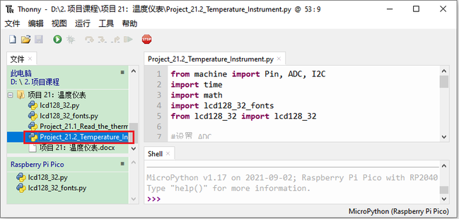

项目现象：

确保树莓派Pico板已经连接到电脑上，单击“停止/重启后端进程”。

单击“运行当前脚本”，代码开始执行，你会看到的现象是：LCD 128X32 DOT的屏幕上显示热敏电阻的电压值和当前环境中的温度值。按“Ctrl+C”或单击“停止/重启后端进程”退出程序。

